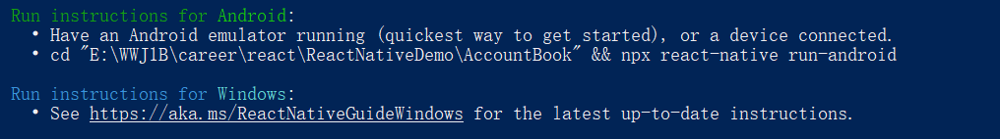
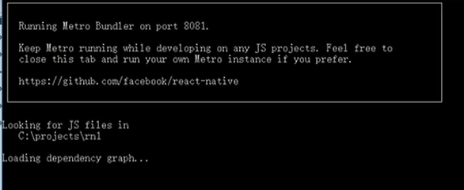
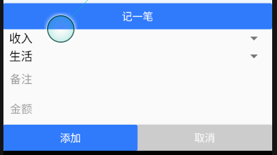
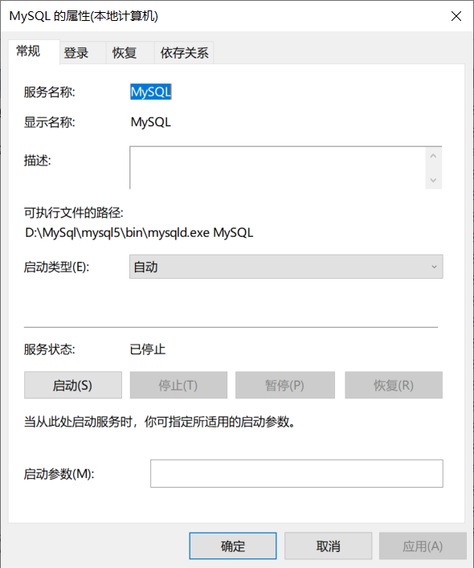
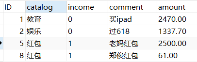

# [环境搭建](https://reactnative.cn/docs/environment-setup)

### 问题：[Node,JDK](https://reactnative.cn/docs/environment-setup#node-jdk)(node版本需要12过高会导致错误)

> - 使用nrm工具切换淘宝源
>
> npx nrm use taobao
>
> - 如果之后需要切换回官方源可使用
>
> npx nrm use npm


# 脚手架安装

```shell
npm i react-native-cli -g
```

- 出现（yarn 和 npm混用）

>  react-native -v
> react-native-cli: 2.0.1
> react-native: n/a - not inside a React Native project directory

```shell
npm install --save react-native
npm config set registry https://registry.npm.taobao.org
npm config set disturl https://npm.taobao.org/dist
```

提示：yarn可以不装


# 项目创建

## 步骤1：

```shell
react-native init MyApp --version 0.55.4
```

- 出现`Warning: Accessing non-existent property 'padLevels' of module exports inside circular dependency`

  Node版本过高

  解决方案：nvm对node版本管理（不行，连不上）

  https://www.cnblogs.com/zjknb/p/11715007.html

  ```
  第一步：下载nvm并安装 (推荐使用nvm-setup.zip) https://github.com/coreybutler/nvm-windows/releases
  
  第二步：使用nvm命令切换node版本
  nvm                  // 会提示nvw下的相关命令
  nvm ls               // 查看已安装node版本
  nvm install vXX      // 安装对应vXX版本的node
  nvm uninstall vXX    // 卸载对应vXX版本的node
  nvm use xxx          // 选择使用XXX版本
  无需配置环境变量，亲测成功
  ```

  下载node进行切换

  ```
  D:\中移铁通\app>nvm list
  
    * 14.4.0 (Currently using 64-bit executable)
      10.19.0
  
  D:\中移铁通\app>nvm use 10.19.0
  Now using node v10.19.0 (64-bit)
  
  D:\中移铁通\express>node -v
  v10.19.0
  ```
  
  解决方案：
  
  直接卸载重装

## 步骤2：

```
react-native init AccountBook(项目名)
```

完成安装：



```
npx react-native run-android
```

- 出现

报错：Could not install the app on the device, read the error above for details.Make sure you have an Android emulator running or a device connected and have set up your Android development environment

解决方案：

1.打开adb

2.cmd中输入adb devices查看详情

3.再次`npx react-native run-android`则可以成功运行


# ReactNative概述

- react-native：原生移动应用、编译
  1.样式——编译成原生代码（和原生兼容的样式）
  2.HTML——自己的组件（e.g. view picker button）
  3.95%正常使用React
  4.95%正常使用JS
  5.主打flex布局

- 单位：
  %
  数字

可以自己制作单位

# 需要自学的知识点

- 获取数据fetch

- 箭头函数

  ```js
  (param1, param2, …, paramN) =>{ return expression; }
  //相当于
  function(param1, param2, …, paramN)={return expression;}
  ```

- React Hook

- React及Redux

- 复习node 如`${}`模板

- KOA

- fetch

# 需要解决的问题

1. Android Studio对React中js文件没有提示

   可以使用atom进行编辑，Android Studio仅仅打开AVD

2. 自己找的视频讲解的都是class组件的，那function component 就很难写

   现在学会的就是React （class组件）还没学React hook（function component），改的话要一个个查，要不要先看完教程，顺便复习之前学的react然后等学完react hook再项目重建一遍

# 已解决问题

1. 文件路径下文件名字红色

   添加到git就不红了，红的说明ignore了


# React Native官方例程（Indicates）


自己的第一次试验（修改app.js）

```js
import React from 'react';
import type {Node} from 'react';
import {
  Text,
  View,
} from 'react-native';


const App = () => {
            return (
              <View style={{ flex: 1, justifyContent: "center", alignItems: "center" }}>
                <Text>
                  Try editing me! 🎉
                </Text>
              </View>
            );
};
export default App;

```


# 自己找的学习资料

https://www.bilibili.com/video/BV1Pt41187cj?t=905

【智能社】（实战案例）主讲老师：石川（Blue）React+Node记账app（是class形式的还需要各种转换为 Function Component）



Bundler是往安卓机下载东西的窗口

1. `View` 替代`div`

2. 所有的text都必须放在`<Text></Text>`中

   

## - 自定义样式的设定

> 注意点：
>
> 1.function在es6中的export和import
>
> 2.style={{}}外面的{}是react的引用，内部的{}是json字符串
>
> 3.只能使用基础样式`backgroundColor`
>
> 4.position:fixed在reacNative中用不了，只能用position:absolute

在utils/common.js中定义单位转化函数

```js
import {Dimensions} from 'react-native';
//基准宽度往往是ps等图片大小宽度
const BASE_WIDTH =750;
const calc =(size)=>{
  let {width}=Dimensions.get('window');
  return size*width/BASE_WIDTH;
}

export {calc};
```

在App.js中引入使用

```js
import {calc} from './utils/common'
   <Text style={{width:calc(750),height:calc(100),backgroundColor:'pink'}}>
                  Try editing me! 🎉
                </Text>
```


## - 启动页

> 注意点：
>
> 1.style样式的添加

**存在的问题:不会使用function component写**

```js
//StartUp.js
import React, { Component } from 'react';
import { Image, Text, View, StyleSheet } from 'react-native';
import { calc } from '../utils/common'
class StartUp extends Component {
    constructor(props) {
        super(props)
    }

    render() {
        return (
            <View style={styles.bg}>
                {/* 套上两层是因为很多时候Image和Text并没有办法撑起布局，需要View撑起布局 */}
                <View style={styles.logoContainer}>
                    {/* node中资源加载需要require */}
                    <Image style={styles.logo} source={require('../assets/logo.png')} />
                </View>
                <View  style={styles.titleContainer}>
                    <Text style={styles.title}>王文婧已经人没了</Text>
                </View>
            </View>
        )
    }
}

const styles = StyleSheet.create({
    bg: { backgroundColor: '#2d7afc', height: " 100%" },
    logo: { width: calc(281), height: calc(111) },
    logoContainer: { flexDirection: 'row', justifyContent: 'center', marginTop: calc(280) },
    title:{color:'#FFF',fontSize:calc(64)},
    titleContainer:{flexDirection:'row',justifyContent:'center'}
})

export default StartUp;
```


## 页面跳转

使用**react-native的router-flux**

- 遇到的问题

yarn:`yarn add react-native-router-flux`

npm：`npm install react-native-router-flux -save`

如果npm安装失败

尝试

```
npm config delete proxy
npm config set https-proxy
```


如果还是不行，则可以使用yarn安装

前提：

1.删除package.lock文件

2.npm install -g yarn react-native-cli

3.v2rayn全局代理

4.yarn config set registry https://registry.npmjs.org --global

---

### Getting Started

1. Install native dependencies used by RNRF (see below, https://reactnavigation.org/docs/en/getting-started.html)
2. Install this component

```
yarn add react-native-router-flux
```

### install the following libraries first

1. react-native-screens by ( `npm install react-native-screens || yarn add react-native-screens`)
2. react-native-gesture-handler ( `npm install react-native-gesture-handler || yarn add react-native-gesture-handler`)
3. react-native-reanimated (`npm install react-native-reanimated || yarn add react-native-reanimated`)
4. react-native-safe-area-context (`npm install react-native-safe-area-context || yarn add react-native-react-native-safe-area-context`)
5. @react-native-community/masked-view (`npm install @react-native-community/masked-view || yarn add @react-native-community/masked-view`)


### - 1.App首屏显示

App.js

```js
import React, { Component } from 'react';
import { calc } from './utils/common'
// 所有路由文件都包裹在Router
//所有路由节点都包裹在Scene
import { Router, Scene } from 'react-native-router-flux'
// import {
//   Text,
//   View,
// } from 'react-native';

import StartUp from './components/StartUp';
class App extends Component {
  constructor(props){
    super(props);
  }
  render() {
    return (
      //  Router中只能有一个Scene,Scene可以嵌套
      //  需要给Scene添加key否则无法进行引用 Scene属性包含：initial表示是否为首页面
      <Router>
        <Scene key="root">
          <Scene key="startup" component={StartUp} initial="true" />
        </Scene>
      </Router>
    );
  }
}

export default App;
```

### - 2.首屏跳转List.js

- 在App.js中添加List跳转路由

  ```js
  import List from './components/List';
  //其他代码
  <Scene key="list" component={List}  hideNavBar={true}/>
  ```
  
- 时间设置在StartUp.js中

  ```js
  import {Actions} from 'react-native-router-flux';
  //不需要下面这样
  //import List from './List';
  
  
  //其他代码
    componentDidMount(){
          setTimeout(function(){
              //接收两个参数
              //跳转至哪个界面，第二个参数是props，放了就会成为第一个界面的props
              Actions.push('list',{});
           
          },2000)
      }
  ```

### - 3.List中点击按钮弹窗输入

见：功能2：向数据库上传信息

## - 账本页样式编写

> 注意点：
>
> 1.能指定高度的，如titleContainer指定高度
>
> 2.FlatList的运用
>
> 3.flex布局，两边width指定，中间一个可以使用flex:1居中
>
> 见：rn1中的List.js
>
> <Text style={{width: calc(80)}}>{item.catalog}</Text>
>
> <Text style={{flex: 1}}>{item.comment}</Text>
>
> <Text style={{width: calc(120), textAlign: 'right'}}>{item.income?'+':'-'}{item.amount}</Text>
>
> 4.也可以指定
>
> flex:1 flex:2 flex:2 这样宽度会1:2:2进行划分
>
> 5.文字居右:
>
> marginRight:'auto'
>
> textAlign: 'right'

List.js中
```js
  render() {
        return (
            // navigation
            <View style={{ height: "100%", backgroundColor: '#FFF' }}>
                <View style={{ height: calc(100), flexDirection: 'row', justifyContent: 'center', backgroundColor: '#2d7afc' }}>
                    <Text style={{ fontSize: calc(38), color: '#FFF', fontWeight: 'bold', marginTop: calc(30) }}>王文婧的小金库</Text>
                </View>

                {/* 概览 */}
                <View style={{ flexDirection: 'row', backgroundColor: '#2d7afc', paddingTop: calc(30) }}>
                    <View style={{ width: calc(150), paddingLeft: calc(5) }} >
                        <Text style={styles.titleSmall}>2021年</Text>
                        <Text style={styles.titleBig}>6月</Text>
                    </View>
                    <View style={{ width: calc(300) }}>
                        <Text style={styles.titleSmall}>支出</Text>
                        <Text style={styles.titleBig}>2563.00</Text>
                    </View>
                    <View style={{ width: calc(300) }}>
                        <Text style={styles.titleSmall}>收入</Text>
                        <Text style={styles.titleBig}>2561.00</Text>
                    </View>
                </View>

                {/* 列表部分 */}
                <View style={{ height: calc(800), backgroundColor: '#F0F8FF' }}>
                    <FlatList
                        data={this.state.records}
                        keyExtractor={item => item.ID + ''}
                        renderItem={({ item }) => (
                            <View style={{ flexDirection: 'row', marginBottom: calc(20), marginTop: calc(20) }}>
                                <Text style={{ color: '#2d7afc', fontSize: calc(30), width: calc(150), paddingLeft: calc(5) }}>{item.catalog}</Text>
                                <Text style={{ color: '#2d7afc', fontSize: calc(30), width: calc(300) }}>{item.comment}</Text>
                                <Text style={{ color: '#2d7afc', fontSize: calc(30), width: calc(300) }}>{(item.income == 1) ? '+' : '-'}{item.amount.toFixed(2)}</Text>
                            </View>
                        )}
                    />
                </View>
            </View>

        );
    }
}

const styles = StyleSheet.create({
    titleBig: { color: '#FFF', fontSize: calc(43), fontWeight: 'bold' },
    titleSmall: { color: '#FFF', fontSize: calc(22) },
})

```

## - 构建服务器（新建一个后端项目）

> 存在问题：
>
> 不知道什么是co-mysql

1.创建文件夹`api_server_account`

2.进入文件夹执行：

``` shell
npm init -y
npm i koa koa-router mysql co-mysql -D
```

3.创建server.js:

### 获取手机本身的ip（ipv4）

```js
const Koa = require('koa');
const Router = require('koa-router');
const mysql = require('mysql');
const coMysql = require('co-mysql');
const os = require('os');

const PORT =8080;

let server = new Koa(); 
server.listen(PORT);

//手机本身就是localhost
//需要获得自己网卡的相关信息
console.log(os.networkInterfaces());
```

输出结果解读：

```js
{
  'VMware Network Adapter VMnet1': [
    {
      address: 'fe80::7c0a:236f:20c2:df52',
      netmask: 'ffff:ffff:ffff:ffff::',
      family: 'IPv6',
      mac: '00:50:56:c0:00:01',
      internal: false,
      cidr: 'fe80::7c0a:236f:20c2:df52/64',
      scopeid: 16
    },
    {
      address: '192.168.11.1',
      netmask: '255.255.255.0',
      family: 'IPv4',
      mac: '00:50:56:c0:00:01',
      internal: false,
      cidr: '192.168.11.1/24'
    }
  ],
  'VMware Network Adapter VMnet8': [
    {
      address: 'fe80::e8d2:6d9d:22c2:55cf',
      netmask: 'ffff:ffff:ffff:ffff::',
      family: 'IPv6',
      mac: '00:50:56:c0:00:08',
      internal: false,
      cidr: 'fe80::e8d2:6d9d:22c2:55cf/64',
      scopeid: 19
    },
    {
      address: '192.168.170.1',
      netmask: '255.255.255.0',
      family: 'IPv4',
      mac: '00:50:56:c0:00:08',
      internal: false,
      cidr: '192.168.170.1/24'
    }
  ],
  WLAN: [
    {
      address: 'fe80::1514:ffc4:a1a4:c48c',
      netmask: 'ffff:ffff:ffff:ffff::',
      family: 'IPv6',
      mac: '68:ec:c5:bd:4b:a1',
      internal: false,
      cidr: 'fe80::1514:ffc4:a1a4:c48c/64',
      scopeid: 8
    },
    {
      address: '10.192.5.60',
      netmask: '255.255.0.0',
      family: 'IPv4',
      mac: '68:ec:c5:bd:4b:a1',
      internal: false,
      cidr: '10.192.5.60/16'
    }
  ],
  'Loopback Pseudo-Interface 1': [
    {
      address: '::1',
      netmask: 'ffff:ffff:ffff:ffff:ffff:ffff:ffff:ffff',
      family: 'IPv6',
      mac: '00:00:00:00:00:00',
      internal: true,
      cidr: '::1/128',
      scopeid: 0
    },
    {
      address: '127.0.0.1',
      netmask: '255.0.0.0',
      family: 'IPv4',
      mac: '00:00:00:00:00:00',
      internal: true,
      cidr: '127.0.0.1/8'
    }
  ]
}
```

### 连接数据库

```js
// 连接数据库
let conn = mysql.createPool({host:'localhost',user:'root',password:'14321432',database:'account_book'});
server.context.db=coMysql(conn);
```

### （不会）对于错误过滤

```js
//全局错误处理
//koa
server.use(async (ctx, next)=>{
    try{
        //next代表之后的所有操作
      await next();
    }catch(e){
      ctx.body={err: 1, msg: 'server error'};
      console.error(e);
    }
  });
```

#### 利用中间件Koa-Router对于数据库查询和数据添加

```js
//Koa-router用法
let router = new Router();

//获取记账
router.get('/list', async ctx => {
  let data = await ctx.db.query('SELECT * FROM record_table ORDER BY ID DESC');

  ctx.body = { err: 0, data };
});
//添加新的记账
http://xxx/add?catalog=xxx&comment=xxx&income=x&amount=xxx
router.get('/add', async ctx => {
  //Kao中获取get数据的方式
  const { catalog, income, comment, amount } = ctx.query;
  const ID = Math.floor(Date.now() / 1000);
  await ctx.db.query(
    "INSERT INTO record_table (ID,catalog, income, comment, amount) VALUES(?,?,?,?,?)",
    [ID, catalog, income, comment, amount]
  );
  ctx.body = { err: 0 };
});

server.use(router.routes());
//Koa-router用法
  let router=new Router();
 
  //获取记账
  router.get('/list', async ctx=>{
    let data=await ctx.db.query('SELECT * FROM record_table ORDER BY ID DESC');
  
    ctx.body={err: 0, data};
  });
  添加新的记账
  http://xxx/add?catalog=xxx&comment=xxx&income=x&amount=xxx
  router.get('/add', async ctx=>{
    const {catalog, income, comment, amount}=ctx.query;
    const time=Math.floor(Date.now()/1000);
  
    await ctx.db.query(
      "INSERT INTO record_table (catalog, income, comment, amount) VALUES(?,?,?,?)",
      [catalog, income, comment, amount]
    );
  
    ctx.body={err: 0};
  });
  
  server.use(router.routes());
```

https://www.jianshu.com/p/f169c342b4d5)

## - 前后端连接

### 功能1：获得数据库中数据

由于服务器地址会发生变化，需要在一个位置独立对于**服务器地址**进行设置

- 在utils/commonjs中：

  ```js
  export const BASE = 'http://10.192.5.60:8080';
  ```

- 在componet/List.js中：

  ```js
  import { calc,BASE } from '../utils/common';
  //其他代码
  this.state = {
              records:[]
          }
  //其他代码
      async componentDidMount() {
          //数据根本回不来情况下的
          try {
              let res = await fetch(BASE + '/list');
              let { err, data } = await res.json();
              //数据回来了，但是数据出错
              if (err) {
                  //RN的Alert组件，参数分别为：title,content,按钮
                  Alert.alert('错误', '请求数据失败', [{ title: 'ok' }]);
              }else{
                  this.setState({
                      records:data
                  })
              }
          } catch (e) {
              Alert.alert('错误', '请求数据失败', [{ title: 'ok' }]);
          }
      }
  ```

  

### 功能2：向数据库上传信息

**功能描述：**

在记账界面：

app.js按钮，点击按钮

AddDialog弹窗输入【类别catalog,备注comment,支出0/收入1 income,数量amount】

页面更新

**List.js**

- 添加按钮

```js
{/* 记一笔按钮 */}
                <View style={{ position: 'absolute', bottom: 0, width: '100%' }}>
                    <Button
                        onPress={this.showAddDialog}
                        title="记一笔"
                        color="#2d7afc"
                    />
                </View>
```


注意在提交后的数据更新

```js
async componentDidUpdate() {
        //数据根本回不来情况下的
        try {
            let res = await fetch(BASE + '/list');
            let { err, data } = await res.json();
            //数据回来了，但是数据出错
            if (err) {
                //RN的Alert组件，参数分别为：title,content,按钮
                Alert.alert('错误', '请求数据失败', [{ title: 'ok' }]);
            } else {
                this.setState({
                    records: data
                })
            }
        } catch (e) {
            Alert.alert('错误', '请求数据失败', [{ title: 'ok' }]);
        }
    }
```

**App.js**

> 知识点：
>
> react-native-router-flux中`Lightbox`

- 设置路由

```js
import React, { Component } from 'react';
import { Router, Scene, Lightbox } from 'react-native-router-flux'

//LightBox知识点：
//LightBox位置：Router内，Scene外
//Router只能有一个子节点，而LightBox可以有多个的子节点
//除了第一个Scene，其他的都会当做Dialog用
import StartUp from './components/StartUp';
import List from './components/List';
import AddDialog from './components/AddDialog';

class App extends Component {
  constructor(props) {
    super(props);
  }
  render() {
    return (
      //  Router中只能有一个Scene,Scene可以嵌套
      //  需要给Scene添加key否则无法进行引用 Scene属性包含：initial表示是否为首页面
      <Router>
        <Lightbox>
          {/* 这是第一个Scene */}
          <Scene key="root">
            <Scene key="startup" component={StartUp} hideNavBar={true} />
            <Scene key="list" component={List} initial={true} hideNavBar={true} />
          </Scene>
          {/* 下面的都会当做Dialog来用 */}
          <Scene key="adddialog" component={AddDialog} hideNavBar={true} />
        </Lightbox>
      </Router>
    );
  }
}
export default App;
```

**AddDialog.js**

- 弹窗样式



```js

    render() {
        return (
            <View>
                <Picker
                    selectedValue={this.state.income}
                    style={{ height: calc(50), width: '100%' }}
                    onValueChange={(itemValue, itemIndex) => this.setState({
                        income: itemValue,
                        catalog: this.catalogs[itemValue][0],
                        catalogs: this.catalogs[itemValue]
                    })}
                >
                    <Picker.Item label="收入" value='1' />
                    <Picker.Item label="支出" value='0' />
                </Picker>

                <Picker
                    selectedValue={this.state.catalog}
                    style={{ height: calc(50), width: '100%' }}
                    onValueChange={itemValue => this.setState({
                        catalog: itemValue
                    })}
                >
                    {this.state.catalogs.map((item) => (
                        <Picker.Item label={item} value={item} />
                    )
                    )}
                </Picker>

                <TextInput
                    style={{ width:'100%',height:40,textDecorationLine:'underline',fontSize: 15,marginLeft:5}}
                    placeholder="备注"
                    onChangeText={text => this.setState({
                        comment: text
                    })}
                />

                <TextInput
                    style={{ width:'100%',height:40, textDecorationLine:'underline',fontSize: 15,marginLeft:5}}
                    placeholder="金额"
                    onChangeText={text => this.setState({
                        amount: text
                    })}
                    keyboardType="number-pad"
                />

                <View style={{ flexDirection: 'row' }}>
                    <View style={{ flex: 1 }}><Button title="添加" color="#2d7afc" onPress={this.submit} /></View>
                    <View style={{ flex: 1 }}><Button title="取消" color="#CCC" onPress={this.cancel} /></View>
                </View>
            </View>

        )
    }
```

- 数据传递（重点）

1.在utils/common.js中编写数据上传的参数串成

`catalog=1&income=2&comment=3&amount=4`形式的工具js

```js
const QueryString = (data) => {
  // data的格式是：
  // {
  //   catalog: this.state.catalog,
  //   income: this.state.income,
  //   comment: this.state.comment,
  //   amount: this.state.amount,
  // }
  let arr = [];
  for (key in data) {
    // 由于组件要提交服务器
    //可编码包裹后上传
    arr.add(encodeURIComponent(key) + '=' + encodeURIComponent(key));
  }
  arr = arr.join('&');
  return arr;
}
export {QueryString};
```

2.在AddDialog.js写点击上传的代码及取消的代码

```js
    cancel = () => {
        Actions.pop();
    }

    submit = () => {
        console.log('假装提交了');
    }
```


# 附录：

## Yarn和Npm指令区别

| NPM                          | YARN                          | 说明                                      |
| ---------------------------- | ----------------------------- | ----------------------------------------- |
| npm init                     | yarn init                     | 初始化某个项目                            |
| npm install/link             | yarn install/link             | 默认的安装依赖操作                        |
| npm install taco —save       | yarn add taco                 | 安装某个依赖，并且默认保存到package.      |
| npm uninstall taco —save     | yarn remove taco              | 移除某个依赖项目                          |
| npm install taco —save-dev   | yarn add taco —dev            | 安装某个开发时依赖项目                    |
| npm update taco —save        | yarn upgrade taco             | 更新某个依赖项目                          |
| npm install taco --global    | yarn global add taco          | 安装某个全局依赖项目                      |
| npm publish/login/logout     | yarn publish/login/logout     | 发布/登录/登出，一系列NPM Registry操作    |
| npm run/test                 | yarn run/test                 | 运行某个命令                              |
| npm get registry             | yarn config get registry      | 查询当前配置的镜像                        |
| npm config set registry xxxx | yarn config set registry xxxx | 设置镜像地址（https://registry.npmjs.org/ |

## 使用命令快速删除node_modules文件夹解决删除慢的问题

先安装删除工具

npm install rimraf -g

然后使用删除命令

rimraf node_modules

**npm install -g 全局安装，以后直接使用删除命令即可。**

## 数据库



需要管理员身份开cmd，cd到mySql路径下开启服务

```shell
D:\MySql\mysql5\bin>net start mysql
```

mySql账号密码：root 14321432

参考链接：

https://www.cnblogs.com/jiyongjia/p/9527499.html

项目中数据库相关信息

数据库：account_book

表：record_table



## koa

### express和Koa区别

Koa支持各项异步操作e.g.async,await

但是express不支持

### Koa文档

Kao-router的运用

# js语法升级

竟然无意之间看到了怎样对于json数组进行循环

```
totalIncome=function(records){
    let sum = 0;
    records.forEach(({ income, amount }) => {
        if (income) {
            sum += amount;
        }
        console.log(sum);
    })
}       
```

