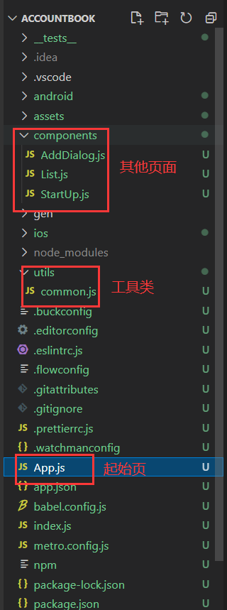
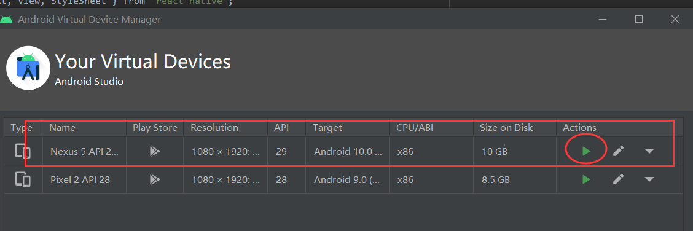
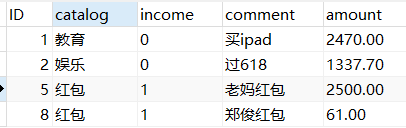
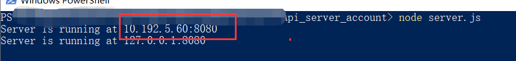
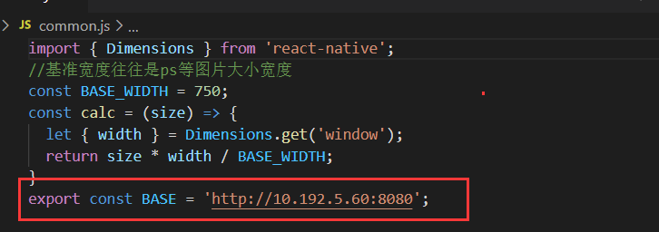
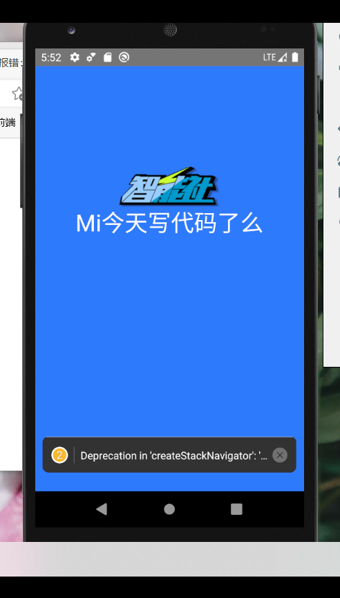
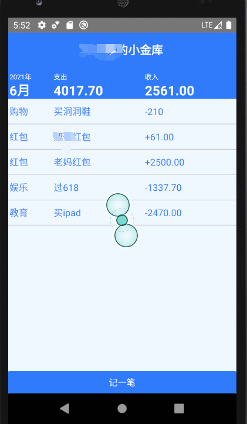

# React Native+Nodejs开发的记账Android App

## 文件说明

|-- AccountBook：前端文件



|-- api_server_account：node后端

​	|-- server.js：服务器代码

|-- Notes：笔记


# 运行环境及前期配置：

1.Android AVD及Android API: Android 10.0(Q)

2.打开Android Studio，运行AVD



3.运行前端代码

打开Powershell

```
cd .\AccountBook\
npx react-native run-android
```

4.运行后端代码：

打开Powershell

```
cd .\api_server_account\
Node server.js
```


## 需要根据自己的情况更改：

### 1.数据库相关配置

MySQL 主机：localhost 账号：root 密码：14321432

数据库：account_book

表：record_table



### 2.请求地址

运行后端代码

控制台显示



将前端代码中 utils/common.js中的BASE替换成你的ip地址



### 其他：软件安装见Note


# 实现功能及效果展示：

- 启动页跳转

- 账本展示（数据库查询，列表显示）

- 记账（数据库数据上传）

- 收入支出自动运算

  




# 特别感谢：

[【智能社】（实战案例）主讲老师：石川（Blue）React+Node记账app](https://www.bilibili.com/video/BV1Pt41187cj?share_source=copy_web)

